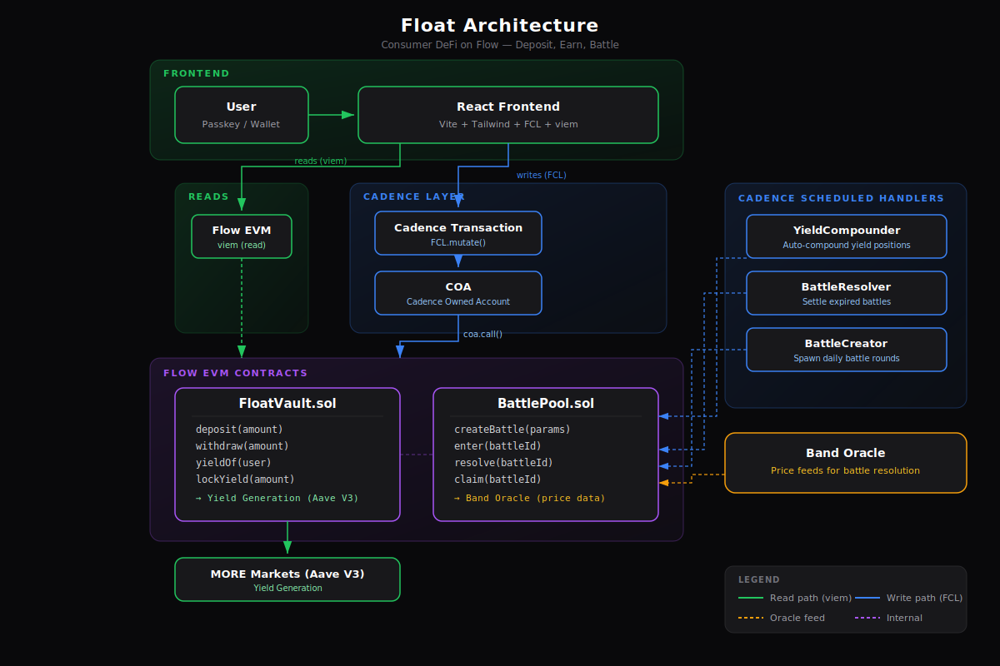

# Float

Deposit USDC. Earn yield. Battle with your upside. Never risk your deposit.

## The Problem

DeFi yields exist but nobody uses them -- the UX is hostile. Prediction markets exist but people risk real money. No product combines passive earning with risk-free engagement where you can only play with what you've already earned.

## How It Works

1. **Deposit USDC** -- Your money is supplied to MORE Markets (Aave V3 fork on Flow) and starts earning 4%+ APY immediately.

2. **Yield accumulates** -- Interest compounds automatically via Flow's native scheduled transactions. No keepers, no bots.

3. **Battle with yield** -- Wager your earned interest on daily predictions (crypto prices, sports, events). Only yield is at risk. Your deposit is always safe.

4. **Win and compound** -- Winnings are added to your principal, so they earn yield too. Losing just means your yield goes to winners.

## Why Flow

Float uses every Flow-native feature that makes consumer DeFi possible:

- **Passkeys (FLIP-264)** -- One-tap signup with Face ID/fingerprint. No seed phrase, no wallet extension.
- **Gas sponsorship** -- Three-role transaction model means users never see gas fees.
- **Scheduled transactions** -- Protocol-level cron jobs for auto-compounding and battle resolution. No keepers needed.
- **Cross-VM (Cadence + EVM)** -- Cadence handlers call Solidity contracts via COA for best of both worlds.

## Architecture



**Frontend reads** from EVM via viem (public client).
**Frontend writes** go through Cadence -> COA -> EVM (FCL.mutate).

## Tech Stack

| Layer | Technology |
|-------|-----------|
| Frontend | React, Vite, Tailwind CSS, FCL |
| Auth | WebAuthn passkeys (FLIP-264) |
| Contracts (EVM) | Solidity 0.8.20, Foundry |
| Contracts (Cadence) | FlowTransactionScheduler handlers |
| Yield | MORE Markets (Aave V3 fork on Flow) |
| Oracle | Band Protocol on Flow |
| Gas | Flow native sponsorship |

## Live Demo

**Testnet app:** [coming soon — deploy to Vercel]

**Deployed contracts (Flow EVM Testnet):**

| Contract | Address |
|----------|---------|
| FloatVault | `0x65aA2d8aa386758CE4032E1628D80F6d4CF8EbbC` |
| BattlePool | `0x807E68C074D761a0617cCDF2E61Db146F0a79Aad` |
| MockUSDC | `0x5308C7C3f9A5D5242C9462B10C927AD73Cd7E7eE` |

**Cadence contracts:** deployed to `0xf865549035cf159a` on Flow Testnet.

## Quick Start

```bash
# Install dependencies
npm install

# Run Solidity tests (19/19 passing)
cd contracts && forge test

# Start frontend (testnet)
npm run dev
```

## Contracts

**FloatVault.sol** -- Core vault managing user deposits and yield tracking:
- `deposit(amount)` -- Supply USDC to lending pool, track principal
- `withdraw(amount)` -- Withdraw principal (protected against battle underfunding)
- `yieldOf(user)` -- Calculate available yield (pro-rata, minus locked amounts)
- `lockYield/unlockYield` -- Battle pool integration for wagering
- `creditWinnings` -- Add battle winnings to principal (compound effect)

**BattlePool.sol** -- Prediction battle system:
- `createBattle(...)` -- Oracle-resolved crypto battles
- `createEventBattle(...)` -- Admin-resolved event battles
- `enter(battleId, side, amount)` -- Wager yield on YES or NO
- `resolve(battleId, actualPrice)` -- Auto-resolved via scheduled handler
- `claim(battleId)` -- Winners collect proportional payout (5% protocol fee)

19/19 Foundry tests passing.

## Revenue Model

- **5% of losing side** on every battle
- **Yield spread** -- 0.33% between protocol rate and user rate
- **Premium battles** (V2) -- sponsored battles with larger pools

## Project Structure

```
float/
|-- src/                      # React frontend
|   |-- components/           # UI components
|   |-- config/               # Flow + viem config
|   '-- lib/                  # Passkey auth, transactions, ABIs
|-- contracts/                # Foundry project
|   |-- src/                  # FloatVault.sol, BattlePool.sol
|   |-- test/                 # 19 tests
|   '-- script/               # Deployment scripts
|-- cadence/
|   |-- contracts/            # Scheduled tx handlers
|   |-- transactions/         # COA setup, deployment, scheduling
|   '-- scripts/              # Read helpers
'-- flow.json                 # Flow project config
```

## License

MIT
